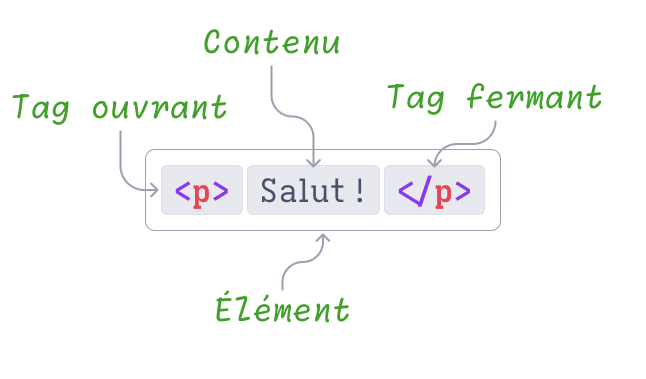
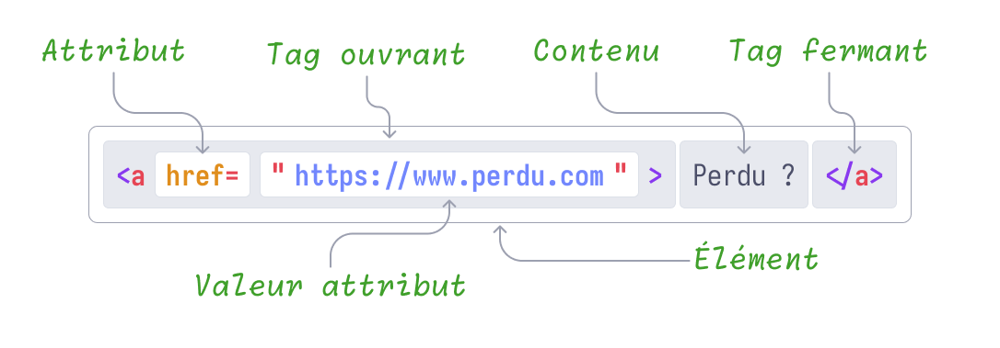
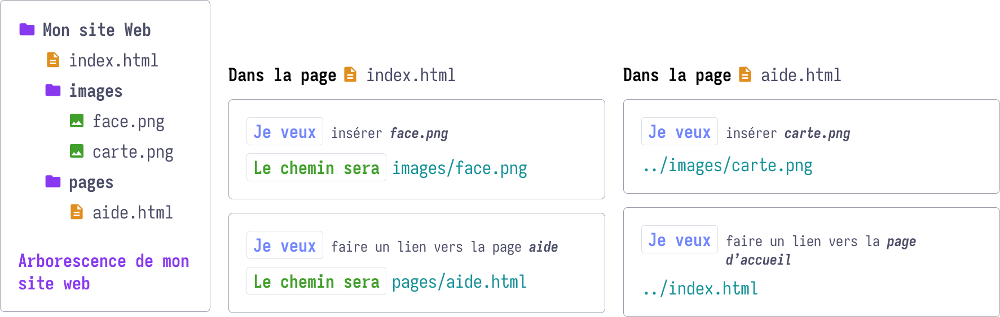

<!-- _class: lead-->

# Introduction au web

---

## Les prémices du web

- [Création en 1989][1] au <abbr title="Significatio du CERN">CERN</abbr>;
- Disponible pour le grand public en 1993;
- Le premier navigateur, [WorldWideWeb][2] est créé;
- Le fameux _www_ vient de là;
- **Création du W3C _(WorldWidWeb Consortium)_ en 1994**.

---

## Objectifs du W3C

- **Pérenniser** le web;
- Créer des **standards technologiques**;
- Permettre au **plus grand nombre** l’accès à l’information

---

<!-- _class: alt-->

## Le plus grand nombre : un des principes fondamentaux du web

Permettre l’accès au web quel que soit le matériel, le logiciel, le langue, la localisation ou les capacités d’un utilisateur

**Pour en apprendre plus sur l’[accessibilité du web][4]**

---

<!-- _class: invert-->

## Les outils

Installation, découverte et premiers pas sur _Visual Studio Code, Github, Github Desktop_

---

## Visual Studio Code


---

## Installation de Visual Studio Code

- Se rendre sur [code.visualstudio.com](https://code.visualstudio.com/);
- Télécharger la version adaptée à votre système d’exploitation;
- Installer l’application;
- Lancer l’application;

<div class="alert">
<strong>Sur Mac</strong>, copiez l’application dans votre dossier <em>Applications</em>
</div>

---

<!-- _class: alt-->

## Visual Studio Code

- _Foss_ (as Free and Open Source Software) gratuit et code libre;
- Proposé et développé essentiellement par **Microsoft**;
- Logiciel le plus courant aujourd’hui pour faire du code;
- Souvent appelé _VS Code_ par les _connoisseurs_;

🍿 Une vidéo d’introduction à l’utilisation du logiciel [par Kevin Powell (en)][5].

<div class="alert">
  À ne pas confondre avec Visual Studio qui est un autre logiciel.
</div>

---

## Git, Github, Github Desktop : installation

1. Se rendre sur [github.com](https://www.github.com);
2. Se créer un compte;
3. Télécharger et installer [Github Desktop](https://desktop.github.com/download/);
4. Lancer _Github Desktop_ et s’identifier avec son compte _Github_;

**Github** est un service proposé par Microsoft (encore) utilisant la technologie _git_, technologie créé par le créateur de Linux, _Linus Torvald_.

---

## Git et Github vont nous permettre de…

1. **Créer des versions** d’un projet et ses fichiers;
2. **Collaborer** et se **synchroniser** sur un projet à plusieurs;
3. **Conserver un référentiel (_repository_)** du code qui a été réalisé en local sur son ordinateur ou à distance avec un service comme _Github_ par exemple.

---

## Quelques termes propres à git

- **Dépôt, repository, repo, référentiel** : L’endroit ou est votre code;
- **_Commit_** : Un point d’enregistrement sur votre ordinateur seulement;
- **_Push_** : mettre à disposition un ou plusieurs _commits_ à distance;
- **_Pull_** : récupérer les _commits_ des autres participants;
- **_Fetch_** : récupère les informations de modifications distantes sans modifier le code courant;

📖 [An introduction to Git for UI/UX designers(EN)][7]

---

## Un premier projet avec git, github et VS Code

- Créer un _repository_ sur Github;
- Avec **Github Desktop**, _cloner_ ce dépôt;
- Ouvrir le dossier cloné avec **VS Code**;
- Créer un nouveau fichier intitulé `index.html`;
- Faire un _commit_ de cette modification puis _poussez_ cette modification;

🍿 Une vidéo d’introduction à l’usage de [Github Desktop avec VS Code(FR)][6].

---

## HTML, CSS et JavaScript : Le trio gagnant

Ensemble, ces trois langages permettent de créer des sites web complets, esthétiques et interactifs.

- **HTML, HyperText Markup Language** : le contenu, un document texte structuré avec des balises;
- **CSS, Cascading Stylesheet** : le langage qui va déterminer le style visuel des éléments _html_;
- **JavaScript (pas Java)** : amène l’interactivité aux pages web, permet de manipuler dynamiquement le contenu est les styles

---

<!-- _class: invert-->

## HTML


---

<!-- _class: alt-->

## Créer un document html dans VS Code

1. Créer un nouveau fichier, nommez le en ajoutant l’extension `.html`;
2. Assurez-vous que le document soit bien de type _html_ (_language mode_);
3. Dans le document tapez le caractère `!` suivi de tabulation `⭲`;

Si tout s’est bien passé, VS Code vous a créé la structure de base d’un document HTML prêt à être utilisé.

<!-- Sortir ? -->

---

## Élément, balise et attribut

- **Élément** : Structure représentant un composant, comme un paragraphe, un lien, ou une image. Généralement composé d’une balise ouvrante, d’un contenu, et d’une balise fermante.
- **Balise HTML** : Marqueur utilisé pour définir le début et la fin d’un élément. Elles sont entourées de chevrons (`<` et `>`).
- **Attribut** : permet d’ajouter des informations à un élément, définissant ses propriétés, son comportement ou son apparence.

---



Un simple paragraphe montrant un tag (ou balise) ouvrant(e), une balise fermante, le contenu.
Cet ensemble se nomme un élément, ici un élément de type paragraphe.

---



---

## Le contenu

À noter que le contenu d’une balise est du texte mais peut aussi être un ou plusieurs **éléments**.

```html
<p>
  <span>Exemple</span> d’un paragraphe
  avec d’<em>autres <i>éléments</i></em>
  <b>imbriqués</b>.
</p>
```

---

<!-- _class: alt -->

## Structure de base d’un document HTML

- La déclaration `<!DOCTYPE html>`;
- La structure de base avec les balises `<html>`, `<head>`, et `<body>`;

---

## La déclaration `<!DOCTYPE html>`

Indique au navigateur que le document est de type `html`, _super_.

---

## La structure de base avec `<html>`, `<head>`, et `<body>`

- `<html>` : La balise qui contient tout, sauf la première déclaration;
- `<head>` : L’entête du document, contiendra le titre du document, les liens vers des fichiers externes (CSS, JavaScript) et d’autres règles invisibles;
- `<body>` : Le contenu visible du document, textes, images, liens, formulaires et tous les autres éléments interactifs.

---


<!-- _class: alt -->
## Intermède : taper du code poliment

Pour rendre votre code plus lisible, essayez ces différents conseils :

1. Utilisez l’indentation (touche *tabulation*,`⭲`) pour rendre l’imbrication du code lisible;
2. JAMAIS de majuscules, c’est pour les élèves de maternelle seulement;
3. Utilisez les commentaires pour décrire ce que vous faîtes;
4. Sautez des lignes pour visuellement visualiser les différentes sections de votre code.

---

```html
<!-- Les grands règnes naturels -->
<section>
  <h2>Les plantes</h2>
  <p>Lorem ipsum dolor sit amet consectetur</p>
</section>

<section>
  <h2>Les animaux</h2>
  <p>Lorem ipsum dolor sit, amet consectetur adipisicing elit</p>
</section>
```

```html
<section><h2>Les plantes</h2><p>Lorem ipsum dolor sit
amet consectetur</p></section><section><h2>Les animaux
</h2><p>Lorem ipsum dolor sit, amet consectetur
adipisicing elit</p></section>
```


---

## Les balises de contenu

- Un peu de sémantique;
- `<!-- Les commentaires -->`
- Balises (`<h1>` à `<h6>`);
- Paragraphes (`<p>`);
- Emphases (ou pas) `<em>, <strong>, <b> et <i>`
- Les listes et leurs éléments (`<ul>`, `<ol>`, `<li>`);
- Les liens hypertexte (`<a>`), l’attribut `href`
- Balise `` : attributs `src`, `alt`, `width`, `height`;

---

## La sémantique

L’art de choisir la meilleure balise pour son contenu.

### Objectifs

- Être mieux compris **par les tous humains** y compris les personnes ayant un handicap;
- Être mieux compris par les _machines_, meilleur référencement ou indexation : **SEO optimisée**.

---

<!-- _class: invert -->

## À noter

Les exemples que vous allez voir ne sont qu’un extrait du document, la plupart du temps l’exemple est un extrait du _body_ du document.

L’utilisation de l’ellipse (…) indique un contenu qui se poursuit.

---

## Les commentaires

```html
<p>J’adore l’html</p>
<!-- C’est faux, mais j’aime faire plaisir à mon prof -->
```

Un commentaire permet de noter une information sur un bout de code, ici en `html`.

- Cet élément ne sera pas directement visible;
- Visible aux curieux qui irait inspecter le source de votre document.

---

## Balises (`<h1>` à `<h6>`)

```html
<h1>Recettes</h1>

<h2>Entrées</h2>
<h3>Végétariens</h3>
<h3>Omnivores</h3>

<h2>Plats</h2>
<h3>Végétariens</h3>
<h3>Omnivores</h3>

```

Ces balises donnent **un plan au document**, comme cette page de recettes avec Entrées, Plats et leurs variantes végétariennes ou omnivores.

---

## Petit exercice

En utilisant les titres `<h1>` à `<h6>` faites une nouvelle page qui décrit les artistes que vous écoutez le plus souvent organisés par genres et par époques.

---

## Paragraphe

```html
<p><!-- Un paragraphe vide --></p>
<p>Le HTML (HyperText Markup Language) est le langage de base pour créer des
pages web. Il structure le contenu en utilisant des balises.</p>
<p><!-- Un autre paragraphe vide --></p>
```

Un paragraphe est un élément permettant de délimiter du texte en blocs distincts (tant sur le contenu que sur la forme).

---

## Emphases

**L’emphase** en linguistique est l’action d’accentuer un élément du discours pour lui donner plus d’importance ou souligner une variation (ironie).

---

## Emphases, ou pas ? `<em>, <strong>, <b> et <i>`

- `<em>` indique une emphase légère;
- `<strong>` indique une emphase forte;
- `<b>` pour mettre le texte en gras, emphase visuelle seulement;
- `<i>` pour mettre le texte en italique, emphase visuelle seulement.

Les balises `<b>` et `<i>` sont utilisées uniquement à des fins visuelles.

---

## Emphases (ou pas), des exemples

```html
<p>Découvrez nos <strong>supers offres !</strong></p>
<!-- On veut insister sur les offres qui sont supers -->

<p>Encore <em>une bonne blague</em> de nos dirigeants.</p>
<!-- On veut noter l’ironie de ce qui est présenté -->

<p><i>J’aime les mathématiques</i>, <b>c’est super</b>.</p>
<!-- On veut simplement donner un style visuel -->
```

---

## Les listes

Pour énumérer des ingrédients dans une recette, les morceaux d’un album… **ou les liens présents dans une navigation**. Principalement deux types de listes sont à notre disposition.

- Des listes non ordonnées, l’ordre des éléments qui y sont n’a pas de signification particulière;
- Des listes ordonnées, l’ordre des éléments a un sens.

---

## Les listes non ordonnées

```html
<h2>Ingrédients</h2>
<ul>
  <li>Sel, poivre</li>
  <li>Carottes</li>
  …
</ul>
```

Dans cet exemple, une liste d’ingrédients pour une recette, l’ordre des éléments n’a pas d’importance.

---

## Les listes ordonnées

```html
<h2>Résultats de recherche pour le mot clef <em>banane</em></h2>
<ol>
  <li>La banane, ce fruit extraordinaire</li>
  <li>Ayez la banane tous les jours</li>
  <li>Les 5 meilleurs sacs banane de cette année</li>
  …
</ol>
```

Dans cet exemple, l’ordre des éléments a une importance, en utilisant `<ol>` on signifie que l’ordre veut dire quelque chose ici.

---

<!-- _class: alt -->

Ces deux types de listes utilisent **toujours le même et unique élément**, l’élément `<li>` (_List Item_) pour indiquer un nouvel élément de liste.

---

## Suite de l’exercice

En continuant sur la page utilisée dans l’exercice précédent,

- Associez une description à chaque genre en insistant sur les mots clefs propres à chaque style;
- Donnez une liste de 5 artistes associés à chaque genre;

---

## Le lien

Élément fondamental, permet d’accéder à une autre page web, un fichier ou une section du document actuel.

---

## Exemple de lien

```html
<p>Perdu sur internet ? On vous <a href="https://perdu.com">aide</a>.</p>
```

- On ajoute un attribut `href=`, obligatoire;
- Entre guillemets on indique le _chemin_ vers la cible `"https://perdu.com"` (la valeur de l’attribut);

---

## Différents types de liens

```html
<!-- Lien vers une page -->
<p>Perdu sur internet ? On vous <a href="pages/aide.html">aide</a>.</p>

<!-- Lien vers un site web -->
<p>Perdu sur internet ? On vous <a href="https://perdu.com">aide</a>.</p>

<!-- Lien interne vers une section spécifique de la même page -->
<a href="#section1">Aller à la section 1</a>

<!-- Section de destination sur la même page -->
<h2 id="section1">Section 1</h2>
<p>Ceci est le contenu de la section 1.</p>
```

---

## Des images 🍌

```html

```

Balise unique (pas de balise fermante), elle a deux attributs **obligatoires** :

- `src` pour indiquer le chemin vers l’image;
- `alt` permet de renseigner sur le contenu de l’image si cette image venait à manquer ou que l’utilisateur ne peut pas voir les images.

---

## Chemins des liens et des sources

Un chemin ou URL (Unique Ressource Locator) est l’élément qui va indiquer le parcours à emprunter pour retrouver une ressource, l’attribut `href` d’un lien ou le `src` d’une image.

---



---

## Les outils de validation

L’équipe Assurance Qualité du w3c fournit un outil de validation permettant de s’assurer de la validité des documents produits mais aussi de corriger des éventuelles erreurs.

- [Le validateur HTML][11];
- [Tous les outils du w3c][10]

---

## Corriger ses erreurs

- Essayez de corriger les erreurs [de ce document][12];
- Essayez les outils du w3c pour corriger votre propre code.

---

## Ressources externes

- [Apprendre HTML (fr)](https://developer.mozilla.org/fr/docs/Learn/Getting_started_with_the_web/HTML_basics);
- [Web Dev (multilingue)](https://web.dev/learn/html);
- [Open Classrooms (vidéo, fr)](https://openclassrooms.com/fr/courses/1603881-creez-votre-site-web-avec-html5-et-css3);
- [Pierre Giraud - Apprendre à coder en HTML et CSS | Cours complet (2020), (fr)](https://www.pierre-giraud.com/html-css-apprendre-coder-cours/);

---

## À suivre, à lire, à regarder

- [Kevin Powell (en)](https://www.youtube.com/@KevinPowell/videos);
- [A list apart](https://alistapart.com/blog/topic/code/);
- [CSS Tricks, à lire mais aussi pour trouver de bonnes réponses à tout](https://css-tricks.com/);
- [Ahmad Shadeed, designer indépendant un peu trop doué (en)](https://ishadeed.com/)


---
<!-- Références -->
<!-- _class: lead -->

# Bon code !


[1]: https://home.cern/fr/science/computing/birth-web "Le CERN parle de la création du web"
[2]: https://worldwideweb.cern.ch/browser/ "Testez le premier navigateur"
[3]: https://www.w3.org/WAI/fundamentals/accessibility-principles/fr "Accessibilité du web"
[4]: https://www.w3.org/WAI/fundamentals/accessibility-intro/fr "Introduction à l’accessiblité du web"
[5]: https://www.youtube.com/watch?v=EUJlVYggR1Y "How to get started with VS Code"
[6]: https://www.youtube.com/watch?v=jf3zZNoYDYA "Premiers pas avec Github Desktop"
[7]: https://bootcamp.uxdesign.cc/an-introduction-to-git-for-ui-ux-designers-e0802b8ad4ce "An introduction to Git for UI/UX designers (EN)"
[8]: https://fr.wikipedia.org/wiki/Emphase_(linguistique) "Un peu de lecture"
[9]: https://www.youtube.com/watch?v=TQigFxYMeKE "Les chemins relatifs et absolus"
[10]: https://www.w3.org/developers/tools/ "Outils qualité du W3C"
[11]: https://validator.w3.org/nu/ "Le validateur HTML"
[12]: https://github.com/shinze/edd-exo2425/blob/main/erreurs.html "Exercice Erreurs"
